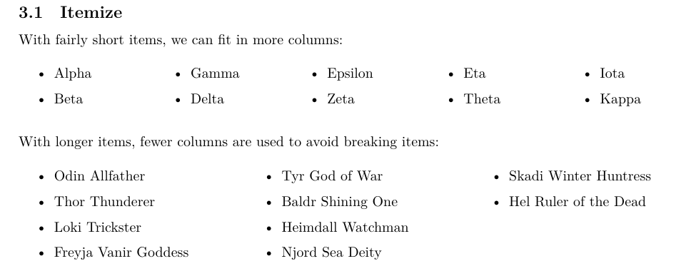
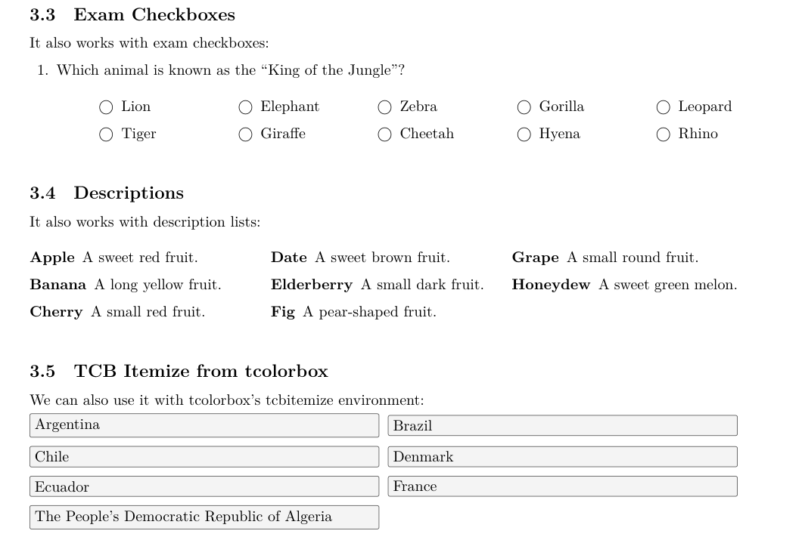

# Columen LaTeX Package

[](https://github.com/ycr/item-brake)
[](https://www.latex-project.org/lppl/)


Columen is a LaTeX package that balances list-like content across multiple
columns while keeping every item intact. On each run the package remembers the
number of columns that fitted without breaking an item and restores that layout
on the next compilation. The result is a consistently compact and readable
presentation of questions, multiple-choice options, or any short list items.




## Features

- `columen` environment that automatically adjusts the number of columns (up to
  a configurable maximum) to avoid splitting list items.
- Persistent column counts stored in the auxiliary file; the layout stabilises
  after two compilations, mimicking the workflow of cross-references.
- `\columenfor` and `\ColumenPatch` helpers to register custom list
  environments.
- Optional `defaults=exam` preset that enables the common list types used by
  the `exam` class.
- Seamless integration with `tcolorbox`’s `tcbitemize` environment.

## Requirements

- LaTeX kernel 2020-10-01 or newer
- `expl3`, `xparse`, `multicol`, `etoolbox`
- Optional: `exam` class, `tcolorbox`

## Installation

Build the package and documentation with `latexmk`:

```bash
l3build unpack
latexmk -pdf columen.dtx
```

or manually:

```bash
tex columen.ins
latexmk -pdf columen.dtx
```

Install the generated files (`columen.sty`, `columen.pdf`) into your local TEXMF
tree or the project directory.

## Quick Start

```latex
\usepackage[defaults=exam]{columen} % optional preset

% Register additional environments if needed
\columenfor{mylist}

\begin{document}
\begin{columen}[5]  % optional maximum number of columns (default: 5)
  \begin{itemize}
    \item Alpha
    \item Beta
    \item Gamma
    \item Delta
  \end{itemize}
\end{columen}
\end{document}
```

Compile twice after substantial edits so that Columen can update the stored
column counts.

## Demo Documents

You can preview the package behaviour by compiling the demo sources shipped in
the repository:

```bash
l3build unpack
latexmk -pdf test.tex      # balanced examples for itemize, enumerate, ...
latexmk -pdf columen.dtx   # user documentation
```

## Contributing

Issues and pull requests are welcome. Please run `l3build check` (if you have
tests) or recompile the documentation before submitting changes so that the
generated files stay in sync.
